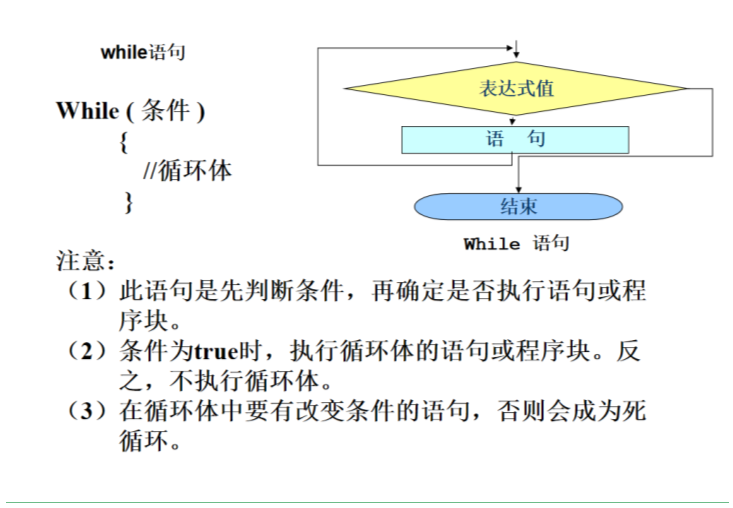
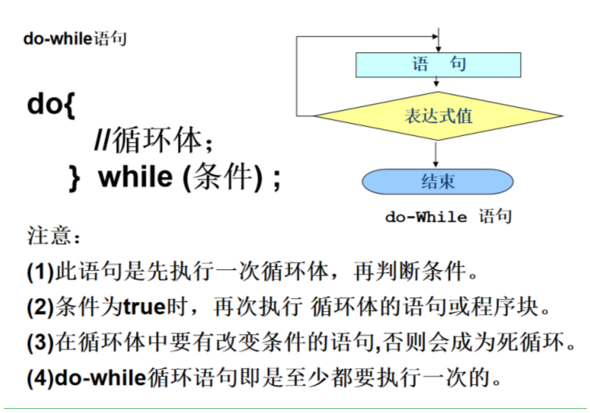
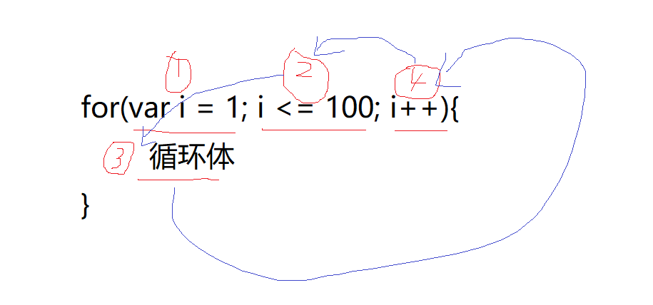

# 循环结构

- 循环结构，就是根据某些给出的条件，重复的执行同一段代码
- 循环必须要有某些固定的内容组成
  1. 初始化
  2. 条件判断
  3. 要执行的代码
  4. 自身改变

<!--more-->

## WHILE 循环



- `while`，中文叫 当…时，其实就是当条件满足时就执行代码，一旦不满足了就不执行了

- 语法 `while (条件) { 满足条件就执行 }`

- 因为满足条件就执行，所以我们写的时候一定要注意，就是设定一个边界值，不然就一直循环下去了

  ```javascript
  // 1. 初始化条件
  var num = 0;
  // 2. 条件判断
  while (num < 10) {
    // 3. 要执行的代码
    console.log('当前的 num 的值是 ' + num)
    // 4. 自身改变
    num = num + 1
  }
  ```

  - 如果没有自身改变，那么就会一直循环不停了


## DO WHILE 循环



- 是一个和 `while` 循环类似的循环

- `while` 会先进行条件判断，满足就执行，不满足直接就不执行了

- 但是 `do while` 循环是，先不管条件，先执行一回，然后在开始进行条件判断

- 语法： `do { 要执行的代码 } while (条件)`

  ```javascript
  // 下面这个代码，条件一开始就不满足，但是依旧会执行一次 do 后面 {} 内部的代码
  var num = 10
  do {
    console.log('我执行了一次')
    num = num + 1
  } while (num < 10)
  ```

  

## FOR 循环

- 和 `while` 和 `do while` 循环都不太一样的一种循环结构 

- 道理是和其他两种一样的，都是循环执行代码的

- 语法： `for (var i = 0; i < 10; i++) { 要执行的代码 }`

  

  ```javascript
  // 把初始化，条件判断，自身改变，写在了一起
  for (var i = 1; i <= 10; i++) {
    // 这里写的是要执行的代码
    console.log(i)
  }
  
  // 控制台会依次输出 1 ~ 10 
  ```

- 这个只是看起来不太舒服，但是用起来比较好用


## BREAK 终止循环 break

- 在循环没有进行完毕的时候，因为我设置的条件满足，提前终止循环

- 比如：我要吃五个包子，吃到三个的时候，不能在吃了，我就停止吃包子这个事情

- 要终止循环，就可以直接使用 `break` 关键字

  ```javascript
  for (var i = 1; i <= 5; i++) {
    // 没循环一次，吃一个包子
    console.log('我吃了一个包子')
    // 当 i 的值为 3 的时候，条件为 true，执行 {} 里面的代码终止循环
    // 循环就不会继续向下执行了，也就没有 4 和 5 了
    if (i === 3) {
      break
    }
  }
  ```


## CONTINUE 结束本次循环 couninue

- 在循环中，把循环的本次跳过去，继续执行后续的循环

- 比如：吃五个包子，到第三个的时候，第三个掉地下了，不吃了，跳过第三个，继续吃第四个和第五个

- 跳过本次循环，就可以使用 `continue` 关键字

  ```javascript
  for (var i = 1; i <= 5; i++) {
    // 当 i 的值为 3 的时候，执行 {} 里面的代码
    // {} 里面有 continue，那么本次循环后面的代码就都不执行了
    // 自动算作 i 为 3 的这一次结束了，去继续执行 i = 4 的那次循环了
    if (i === 3) {
      console.log('这个是第三个包子，掉地下了，我不吃了')
      continue
    }
    console.log('我吃了一个包子')
  }
  ```


## **双重for循环**

for循环可以重复执行一个操作，当然也可以重复执行另一个循环，即for循环里面嵌套for循环，即双重for循环

循环的嵌套： 外层循环循环一次，内层就要循环完

**实例九九乘法表：**

```js
  <script>
        /*
            1x1=1 
            2x1=2 2x2=4 
            3x1=3 3x2=6 3x3=9 
            4x1=4 4x2=8 4x3=12 4x4=16 
            5x1=5 5x2=10 5x3=15 5x4=20 5x5=25 
            6x1=6 6x2=12 6x3=18 6x4=24 6x5=30 6x6=36 
            7x1=7 7x2=14 7x3=21 7x4=28 7x5=35 7x6=42 7x7=49 
            8x1=8 8x2=16 8x3=24 8x4=32 8x5=40 8x6=48 8x7=56 8x8=64 
            9x1=9 9x2=18 9x3=27 9x4=36 9x5=45 9x6=54 9x7=63 9x8=72 9x9=81 
        */
       
      
      
        var i, j, str;
        for (i = 1; i <= 9; i++) { //第一层for循环控制行数
            str = "";
            for (j = 1; j <= i; j++) { //第二层for循环控制列数
                str += i + "x" + j + "=" + (i * j) + " "
                document.write(i+'x'+j + '=' + i*j +' ')
            }
            document.write('<br/>')
            console.log(str);
        }
    </script>
```

